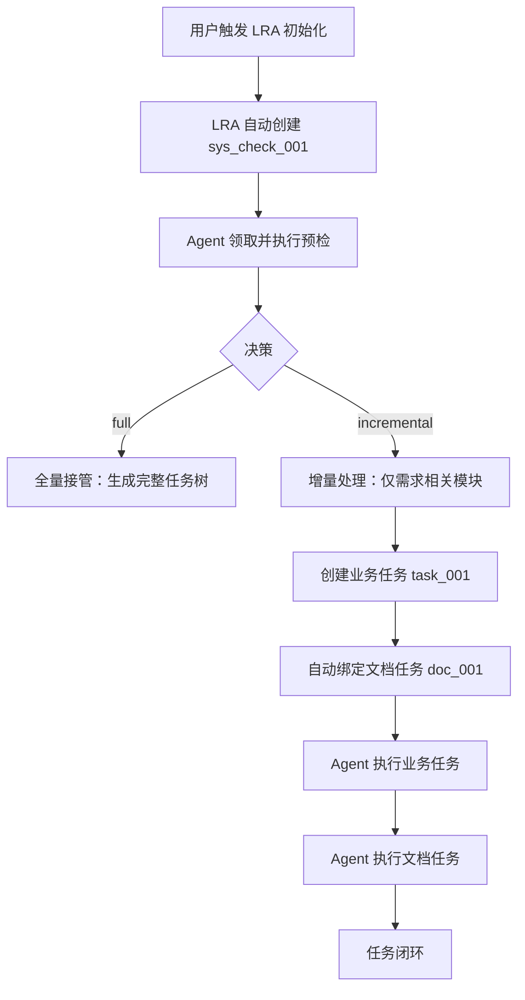

# LRA v3.3.0 新功能实现计划

## 🎯 核心特性

**Agent 自治式初始化 + 增量任务管理**

通过标准化预检→动态增量处理→内置文档闭环，实现 Agent 完全无人干预的自动化流程。

## ✅ 已完成（Phase 1）

### 1. 系统预检任务 (`system_check.py`)

**核心类**:
- `SystemCheckTask`: 系统预检执行器
- `ConfigManager`: YAML 配置管理

**检测维度**:
| 维度 | 指标 | 阈值 |
|------|------|------|
| 代码规模 | `code_total_size_mb` | ≤5MB |
| Git 信息 | `git_valid_ratio` | ≥30% |
| 文档完备度 | `doc_coverage_ratio` | ≥40% |
| 注释完备度 | `func_comment_ratio` | ≥20% |

**决策逻辑**:
- `full`: 满足所有阈值 → 全量接管
- `incremental`: 任意不满足 → 增量处理

**使用方法**:
```python
from long_run_agent.system_check import SystemCheckTask

check = SystemCheckTask(project_path="/path/to/project")
report = check.run()

print(report["decision"])  # full | incremental
print(report["code_total_size_mb"])
print(report["doc_coverage_ratio"])
```

### 2. 配置模板 (`config.template.yaml`)

```yaml
system_check:
  thresholds:
    code_size_mb: 5.0
    git_valid_ratio: 0.3
    doc_coverage_ratio: 0.4
    func_comment_ratio: 0.2
  
  auto_check_on_init: true
  auto_check_on_first_task: true
  doc_enforcement: strict  # strict | soft | disabled
```

### 3. 文档更新模板 (`doc-update.yaml`)

Jinja2 模板，支持：
- 关联业务任务
- 模块定位
- 增量更新
- 文档闭环

---

## ⏳ 待完成（Phase 2-4）

### Phase 2: 增量任务生成策略

**目标**: 根据预检报告自动决策任务生成方式

**实现**:
```python
# TaskManager 增强
def create(self, description: str, ...):
    # 检查是否有预检报告
    if not self._has_system_check():
        # 自动创建预检任务
        self._create_system_check_task()
        
        # 检查是否需要增量处理
        if self._is_incremental():
            # 仅允许创建模块级任务
            if not self._is_module_task(description):
                return False, {"error": "incremental_mode_module_only"}
    
    # 原有逻辑...
```

### Phase 3: 文档闭环任务

**目标**: 业务任务自动绑定文档更新任务

**实现**:
```python
def _create_doc_task(self, business_task):
    """为业务任务创建绑定的文档任务"""
    doc_templates = {
        "feat": "更新{module}模块 README + 接口文档",
        "fix": "更新{module}模块问题排查文档",
        "refactor": "更新{module}模块架构文档",
    }
    
    doc_task = self.create(
        description=doc_templates[task_type],
        template="doc-update",
        dependencies=[business_task["id"]],
        dependency_type="all",
        variables={
            "module": module,
            "update_scope": "auto",
            "user_demand": description,
        }
    )
    
    return doc_task
```

### Phase 4: CLI 命令扩展

**新增命令**:
```bash
# 执行系统预检
lra system-check [--full]

# 查看预检报告
lra system-check --report

# 分析模块
lra analyze-module <module_name>

# 列出系统任务
lra list --type system

# 初始化时自动预检
lra init --name "My Project" --auto-check
```

---

## 📊 预检报告示例

```json
{
  "project_id": "old_project_001",
  "check_time": "2026-02-25T10:00:00",
  "metrics": {
    "code_total_size_mb": 8.5,
    "git_valid_ratio": 0.15,
    "doc_coverage_ratio": 0.25,
    "func_comment_ratio": 0.10
  },
  "decision": "incremental",
  "reason": "代码体积 8.5MB>5MB，文档覆盖率 25%<40%，触发增量处理",
  "suggestions": [
    "分模块分析代码，优先处理核心模块",
    "内置任务要求 Agent 同步更新模块文档",
    "按用户需求范围动态生成子任务"
  ]
}
```

---

## 🚀 Agent 执行流程



---

## 📝 下一步行动

1. **集成到 TaskManager** - 在 create() 时检查预检报告
2. **实现文档任务自动绑定** - 根据任务类型自动创建 doc-update
3. **添加 CLI 命令** - system-check, analyze-module
4. **更新 README** - v3.3.0 特性说明
5. **编写测试** - 预检任务测试

---

## ⚠️ 注意事项

1. **依赖 GitPython**: `pip install GitPython`
2. **依赖 PyYAML**: `pip install pyyaml`
3. **性能考虑**: 大规模项目预检可能需要 10-30 秒
4. **配置优先**: 阈值可通过 YAML 配置调整
